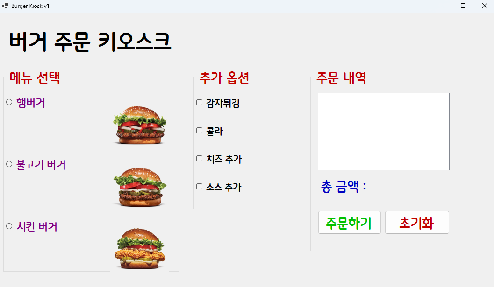
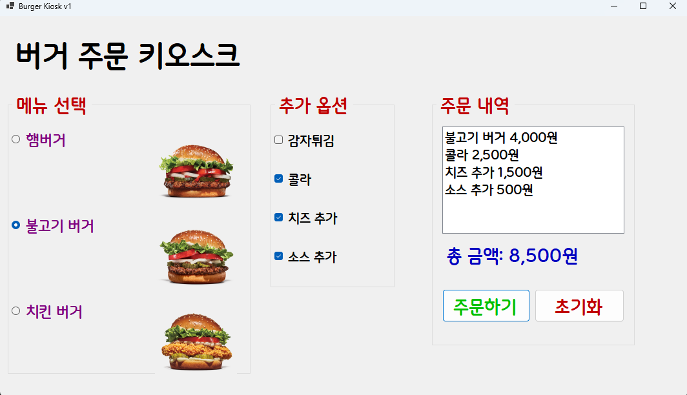
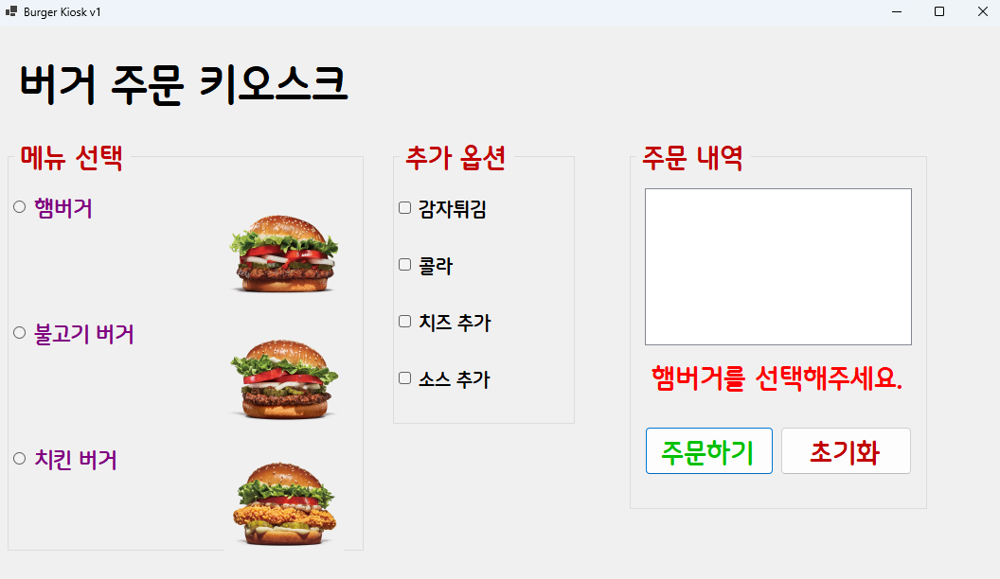
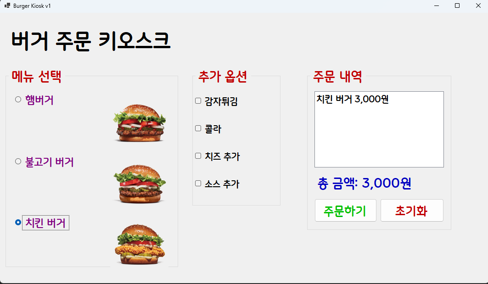
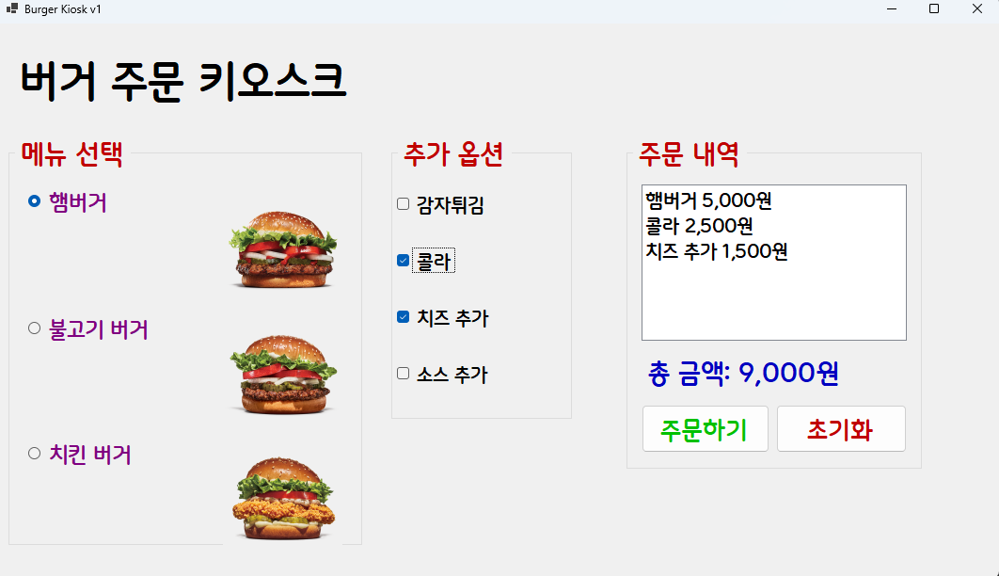
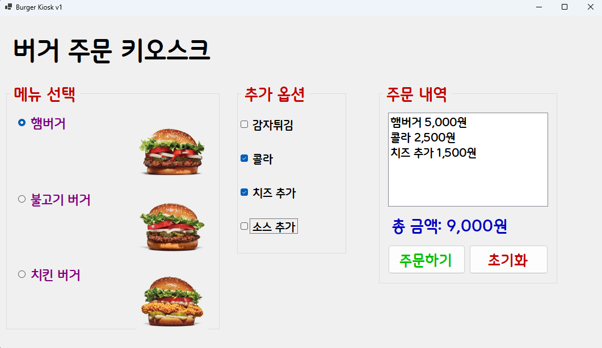

# (C# 코딩) 버거 주문 키오스크

## 개요 - C# 프로그래밍 학습

- 1줄 소개: 버거 주문 키오스크, 버거 선택, 사이드 선택, 주문, 초기화 

- 사용한 플랫폼:
 - C#, .NET Windows Forms, Visual Studio, GitHub

- 사용한 컨트롤:
 - Label, ListBox, Button, RadioButton, CheckBox, PictureBox, GroupBox

- 사용한 기술과 구현한 기능:
 - Visual Studio를 이용하여 UI 디자인
 - string 클래스를 이용한 사용자 입력 데이터 처리
 - 메뉴 선택 기능: RadioButton을 활용한 단일 메뉴 선택
 - 옵션 선택 기능: CheckBox를 활용한 복수 선택 처리
 - 가격 계산 기능: 선택된 항목들의 가격을 합산
 - 이벤트 처리: 버튼 클릭 시 전체 로직 실행
 - 조건문 활용: 선택 여부에 따른 분기 처리
 - UI 업데이트: 사용자 입력에 따라 화면 즉시 반영
 - 속성: Checked, Text, Enabled
 -  메서드: ToString(), Clear()

## 실행 화면
- 코드의 실행 스크린샷과 구현 내용 설명

- 구현한 내용 (위 그림 참조)
- UI 구성 : Label(앱 이름 표시), RadioButton(버거 메뉴 선택), CheckBox(사이드 메뉴 선택), Button(주문, 초기화 버튼), ListBox(주문 내역 표시), PictureBox(버거 이미지 표시), GroupBox(버거 메뉴와 사이드 메뉴 그룹화)
- 선택한 메뉴에 따라 주문 내역이 ListBox에 추가되고, 가격이 계산되어 표시됨

## 실행 화면
- 코드의 실행 스크린샷과 구현 내용 설명

- 구현한 내용 (위 그림 참조)
- 선택된 메뉴가 없을시 메뉴를 선택하라는 메시지 총 금액 부분에 표시 

## 실행 화면
- 코드의 실행 스크린샷과 구현 내용 설명

- 구현한 내용 (위 그림 참조)
- tab, enter, space, 방향키를 이용한 키오스크 조작 가능
- 키보드를 이용하여 메뉴 선택과 주문, 초기화 기능을 사용할 수 있도록 구현

## 실행 화면
- 코드의 실행 스크린샷과 구현 내용 설명

- 구현한 내용 (위 그림 참조)
- 선택한 메뉴에따라 실시간으로 가격이 계산되어 총 금액 부분에 표시
